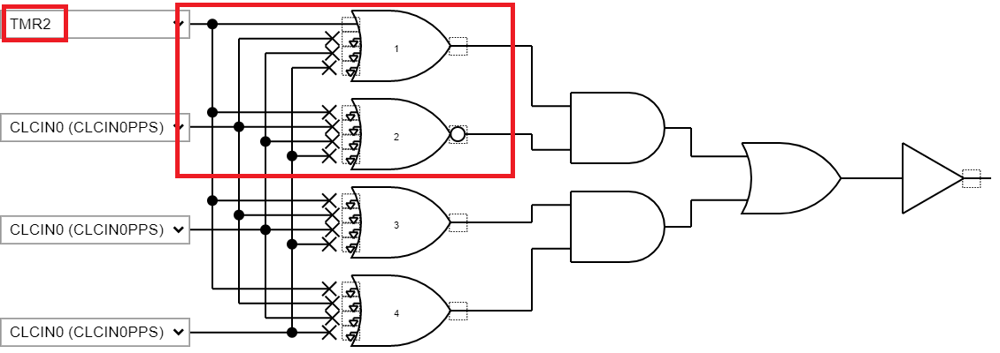

# Dust Sensor Interface using PIC16F18146 Microcontroller

The PIC16F18146 family of devices has a 12-bit differential Analog-to-Digital Converter with Computation (ADCC) which is ideal for sensor application. The GP2Y1014AU0F dust sensor used in this example generates analog output corresponding to the concentration of dust particles present in the air. The output of the sensor is read by ADCC, converted into equivalent dust density, and displayed on the terminal window.
The sensor has specific timing requirements to drive its LED and to sample output voltage. The details of the requirements are covered in the [Sensor Overview](https://github.com/microchip-pic-avr-examples/pic16f18146-dust-sensor-interface-mplab-mcc#sensor-overview) section.  The objective of this example is to accurately meet sensor timing requirements without any software intervention using Core Independent Peripherals such as 16-bit Pulse Width Modulation (PWM) and Timer. The details are covered in the [Implementation Details](https://github.com/microchip-pic-avr-examples/pic16f18146-dust-sensor-interface-mplab-mcc#core-independent-implementation-details) section.

## Related Documentation

-	[PIC16F18146 Product Page](https://www.microchip.com/product/PIC16F18146)
-	[PIC16F18146 Data Sheet](https://www.microchip.com/DS40002339)

## Software Used
- MPLAB® X IDE [6.00 or newer](https://www.microchip.com/mplab/mplab-x-ide)
- Microchip XC8 Compiler [2.40 or newer](https://www.microchip.com/mplab/compilers)
- MPLAB® Code Configurator (MCC) [5.1.9 or newer](https://www.microchip.com/mplab/mplab-code-configurator)
- Microchip PIC16F1xxxx Series Device Support (DFP) [1.14.187 or newer](https://packs.download.microchip.com/)

## Hardware Used
- [PIC16F18146 DIP IC](https://www.microchip.com/product/PIC16F18146)
- [PIC16F17146 Curiosity Development Board](https://www.microchip.com/development-tool/dm164137)
- [GP2Y1014AU0F Dust Sensor](https://www.mouser.in/ProductDetail/Sharp-Microelectronics/GP2Y1014AU0F?qs=rrS6PyfT74eynj5J61tvwA==)
- 150 ohm Resistor
- 220 uF Capacitor
- [Proto Click](https://www.mikroe.com/proto-click)

## Sensor Overview

### Sensor Working
Sharp dust sensors operate on the principle of light scattering. A photodetector and LED emitter oppose each other at an angle within the rectangular package of the sensor which has dust through holes on either side. Air containing dust particles flows into the sensor chamber and causes the light from the LED emitter to be scattered towards the photodetector. The dust sensor outputs a voltage value that varies according to the intensity of the scattered light which in turn corresponds to the level of dust in the air. The actual dust density can then be calculated from the output voltage value using a linear relation.

### LED Driving Signal
According to the sensor datasheet, the LED should be turned on in a pulsed manner. The ‘On’ time for the LED pulse output should be 0.38ms with a period of 10ms. Also, the sensor measurement should be performed after 0.28ms have elapsed from the LED turn on moment. Refer to the below figure for timing details.

| Parameter   | Symbol | Recommendation  | Unit       
| ----------- | ------ | --------------- | ---
| Pulse Cycle | T      | 10 ± 1          | ms
| Pulse Width | Pw     | 0.32 ± 0.02     | ms

Sensor overview source: https://github.com/sharpsensoruser/sharp-sensor-demos/wiki/Application-Guide-for-Sharp-GP2Y1014AU0F-Dust-Sensor

### Core Independent Implementation Details
The LED ON/OFF control and sampling of the output signal at the specified time is performed using PWM, Timer, and ADCC’s auto trigger feature.  

#### PWM Period and ON Time
16-bit PWM can be used to drive the LED. According to sensor timing specification, PWM’s period and on time is as follows,

PWM Period: **10ms**

PWM On Time: **0.32ms**

Thus, duty cycle = (0.32/10) * 100 = **3.2%**

For this example, the PWM1 module is used to generate the required waveform.

The PWM1 module has two PWM outputs, **PWMx_SaP1_out** and **PWMx_SaP2_out**. For this example, only **PWM1_SaP1** is used. PWM period is specified by the **PR** register.

For this example, **500 kHz MFINTOSC** is used as a **PWM1 clock source**.

According to the datasheet,

PWM period = PWM clock period * (PR + 1)

10ms = 2 us * (PR + 1)

PR = **4999**

Also,
PWM ON time = PWM clock period * P1  

0.32ms = 2 us * P1

P1 = **160**

*Note: When using MCC, PR and P1 calculations are not required to be done manually. The user needs to provide PWM “frequency” and “duty cycle” to MCC and MCC takes care of calculating PR and P1 values.*

#### PWM Polarity Control
To turn on the LED, the output signal should be at a logic LOW state and to turn off the LED, the output signal should be at a logic HIGH state. Thus, to drive the LED,the PWM signal must be inverted.

To invert the PWM signal, the **Polarity Control bit (POL1)** is used. Setting the polarity bit inverts the output Active state to low true.

#### ADC Auto Trigger
The output of the sensor should be sampled after **0.28ms** (or 280 microseconds) have elapsed from the moment the LED is switched on.

To sample the signal without software intervention, ADCC’s auto trigger feature is used. **Timer 2** is set as **Auto Trigger Source** for the ADCC module.

Timer 2 is used in **Monostable Mode with Falling Edge Start** mode. In Monostable mode, the value of Count register **(T2TMR)** is compared to that of the Period register **(T2PR)**, on each clock cycle. When the two values match, the comparator resets the value of T2TMR to 0x00 and the timer is stopped. The timer restarts when an external reset event occurs.

**PWM1SIP1_OUT** (It is the same PWM output that is used to drive LED) is used as **External Reset Source** for timer 2. T2PR is set as **139** which provides a period of **0.28ms** (Timer 2 clock has a frequency of 500 kHz). Whenever the falling edge of the PWM waveform occurs, timer 2 starts. After 0.28 ms, the timer stops and provides the trigger for ADCC. It happens in every PWM cycle.  

The below animation demonstrates the operation of PWM and TMR2.

The below block diagram shows the peripherals used and their interconnections as explained before.

## Hardware Setup

In this example, Curiosity LPC board is used as development platform. Proto click which acts as general purpose PCB is used to connect the discrete components to MCU through the microBUS header.

**Important: GP2Y1014AU0F sensor requires 5V to operate. Make sure the J12 jumper on the curiosity board is placed to set 5V.**

*Note: Curiosity LPC board has a LED (D7) connected to the pin RC5 which is output of PWM in this example. Thus, LED D7 will be always turned on.*

## Hardware Connection
A Resister of 150Ω and capacitor of 220uF are required to pulse drive the LED of GP2Y1014AU0F. Refer to the schematic diagram for connection details.
The dust sensor LED terminal is connected to PWM output. The dust sensor VO terminal is connected to the analog input pin.

## Pin Connection Table

| Pin | Name                |  Function       
| --- | ------------------- | ---------------
| RC2 | ADCC Positive Input | Used to sample Dust sensor output voltage          
| RC5 | PWM Output          | Used to drive Dust sensor LED pin     
| RB7 | EUSART TX             | Used to send data to the PC terminal        
| RB5 | EUSART RX             | Used to receive data from the PC terminal
| RC6 | CLC3 O/P            | Used to connect TMR2 o/p to GPIO. (Used only for demonstration. Not required in the final application)          

## Firmware Details
Tasks such as driving the LED and sampling the sensor output at a specific time as per sensor requirements are being handled by core independent peripherals and no CPU intervention is required. Thus, the CPU is free to perform other tasks and only required to read ADCC results as per application needs.

In this example, as there are no other tasks that need to be performed, the ADCC result is being read continuously and converted to dust density. ADCC reading and dust density are displayed on the PC terminal. The microcontroller sends data to the PC using EUSART with the help of the virtual serial port feature of the on-board debugger.

## Demo Operation
The below image shows data printed on the terminal window.

*Note: To see messages in the terminal window, the Curiosity Nano board needs to be connected to the terminal emulator. Data Visualizer which is available as a plugin to MPLAB X IDE can be used as a terminal emulator. Use Baud Rate of 9600.*

## Peripheral Configuration using MCC
This section explains how to configure the peripherals using MPLAB X IDE with MCC plugin for recreation of the project.

Refer [Software Used](https://github.com/microchip-pic-avr-examples/pic16f18146-dust-sensor-interface-mplab-mcc#software-used) section to install required tools to recreate the project.

Additional Links: [MCC Melody Technical Reference](https://onlinedocs.microchip.com/v2/keyword-lookup?keyword=MCC.MELODY.INTRODUCTION&redirect=true)

###### Peripheral Configuration Summary
|    Module                  |    Configuration                                                                                                                                                                                                                                                                                                                                                       |    Usage                                                                   |
|--------------------------------|----------------------------------------------------------------------------------------------------------------------------------------------------------------------------------------------------------------------------------------------------------------------------------------------------------------------------------------------------------------------------|--------------------------------------------------------------------------------|
|    Clock Control           |    Clock Source   - HFINTOSC    HF Internal Clock – 4 MHz    Clock Divider - 1                                                                                                                                                                                                                                                                                  |    System clock                                                            |
|    Configuration   Bits    |    External   Oscillator not enabled     Reset   Oscillator - HFINTOSC (1MHz)                                                                                                                                                                                                                                                                                  |                                                                            |
|    ADCC                    |    Enable ADCC    Input   Configuration- Single Ended Mode    Operating   Mode – Basic Mode    Result   Alignment – Right justified    Positive   Reference – VDD    Auto-conversion   Trigger – TMR2    Acquisition   Count – 50        Clock Source   – FOSC    Clock Divider   – FOSC/4            |    Monitors dust   sensor output                                           |
|    TMR2                    |    Dependency   Selector – TMR2    Enable Timer    Control Mode   – Monostable  External Reset Source - PWM1_OUT1  Start/Reset   Option – Starts on falling edge on TMR2_ers        Clock Source   – MFINTOSC 500khz    Disable   Synchronisation    Prescaler –   1:1     Postscaler –   1:1        Timer Period   – 280 us    |    Triggers ADC                                                            |
|    PWM1 16-bit             |    Enable PWM    Clock Source   – MFINTOSC 500khz    Disable   Synchronisation       Mode – Left   aligned mode    Requested   Frequency – 0.1 kHz    Output1 Duty   Cycle – 3.2%    Enable   Output1 Polarity                                                                                                |    Drivers dust   sensor LED                                               |
|    EUSART1                 |  *UART1 Driver* Requested Baudrate –   9600   UART PLIB Selector - EUSART1   *EUSART1 PLIB*      Enable Redirect   STDIO to EUSART     Enable   Receive   Enable Transmit    Enable Serial   Port                                                                                                                                                                          |    Send data to PC   terminal                                  
|    CLC3                    |    Enable CLC    Logic Cell   Mode bits – AND-OR      (Refer MCC screenshot)                                                                                                                                                                                                                                                                   |   Connects TMR2   output to GPIO (Used only for demonstration purpose)    |

###### Peripheral Configuration using MCC
###### Clock Control

###### ADCC

###### UART1 Driver

###### EUSART1 PLIB

*Note: The on-board debugger present on curiosity development board has a virtual serial port (CDC) can be connected to EUSART on the PIC16F18146 and provides an easy way to communicate with the target application through terminal software. Refer curiosity development board user guide for more details.*

###### PWM 16-bit

###### TMR2

###### CLC

###### Pins

## Summary
This example demonstrated usage of ADCC along with core independent peripherals to interface a dust sensor with minimum software intervention.
